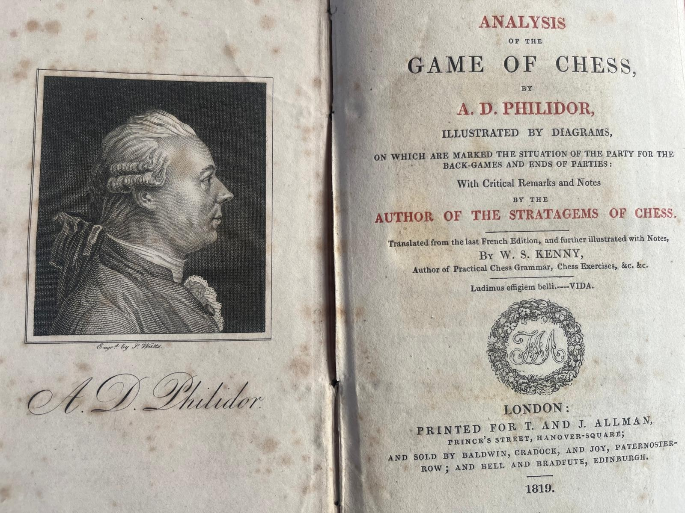

# Analysis of the Game of Chess {.unnumbered}

[François-André Danican Philidor](https://en.wikipedia.org/wiki/Fran%C3%A7ois-Andr%C3%A9_Danican_Philidor) (1726-1795)  was a French composer and chess master. He is considered one of the best players of his time. He is also the author of one of the most influential chess treatises of the eighteenth century, Analyse du Jeu des Échecs.

Leonard Euler, my favorite thinker and mathematician of all time, owned an English translation of the book. Chess Analyzed.

> He found quite beautiful the ways it presented for playing chess; its approach was unique, stressing principles over moves and making pawns the "soul of the game". "Seine grösste Stärke" (His greatest strength), Euler wrote to Goldbach, "besteht in Verteidigung und guter Führung seiner Bauern, um dieselben zu Königinnen zu machen, da er dann, wenn die Anstalten dazu gemacht, pièce für pièce wegnimmt, um seine Absicht zu erreichen und dadurch das Spiel zu gewinnen." (is in the defense and in the skillful moves of his pawns in order to transform them into queens. Then, after proper preparations are made, capturing piece after piece in order to achieve his intention and win the game.) ^[[*Ronald S. Calinger*](https://press.princeton.edu/books/hardcover/9780691119274/leonhard-euler?srsltid=AfmBOopg46j1Tivbm81OHXpqkbTirWUq7njAOmvQzMGOIX-SlyVMLmxp)] 

I own a very very beautiful copy of the 1819 illustrated English edition (See [Editions](./editions.qmd)), but I sometimes find it difficult to follow the games, 
which use descriptive notation and do not always follow the same conventions.
Below is an example of the first lines of the first game in my edition:

1. **W**. King's pawn two squares.

   **B**. The same.
2. **W**. King's bishop to his queen's bishop's fourth square. 

   **B**. The same.
3. **W**. Queen's biship's pawn one square.

   **B**. King's knight to his bishop's third square.

I decided to transcribe the games into algebraic notation so that I could visualize them using a chess engine. 

I think this is the kind of task where LLMs really shine: text extraction, natural language processing, understanding anachronisms,  and ambiguous and inconsistent context and conventions, as well as programmatic and contextual reconstruction, using a chess engine for verification, context information, and human supervision. There has been a lot of hand-holding and verification, but I would say that the results are turning out very nicely.

For more information on how the transcription was done, see [ the methodology](./methodology.qmd).

Each game in the book is presented in its own chapter. Philidor's original move text and extended descriptions are preserved as hover-over elements. 

**Where help is needed**

A game is marked with a 🐞 in the list of chapters when the board does not tell the whole story. This can happen if the board stops before the game ends or if it only reaches the end by reading against the text at a certain move. In this case, the printed text does not allow for a legal continuation. The chapter itself indicates which case applies and where.

No mark means the board follows Philidor's words from the first move to the last. The marks are recalculated each time the book is created, so a corrected game loses its mark.

The [State of the Transcription](state.qmd) file counts how many games are in each condition, explains what each condition means, and lists the games in it.

Even the games marked as completed might contain errors. If you spot something, please let me know.
